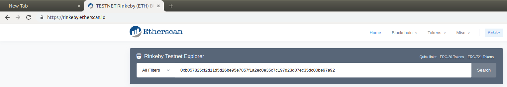

# Module 6b - Beginner Lab: Transactions

## Background
Blockchain technology exemplifies all three components of the CIA triad (confidentiality, integrity, and availability), though the two more obviously implemented components are integrity and availability. The primary use of blockchains to-date has been the tamper-resistant, decentralized storage of transaction information (as opposed to general information, but this is changing). Hence, we will explore transactions in this lab.

## Meta Information
| Attribute | Explanation |
| - | - |
| Summary | Students create, send, receive, and verify transactions. |
| Topics | Transactions, hashes, blocks, and addresses. |
| Audience | CS1 or later. |
| Difficulty | Beginner. |
| Strengths | Hands-on experience with transactions on a blockchain. |
| Weaknesses | Limited scope, and dependence on a specific wallet ([MetaMask][metamask]) and blockchain network ([Rinkeby][rinkeby]). |
| Dependencies | Internet-connected computer with suitable browser ([Chrome][chrome], [Firefox][firefox], etc.), [MetaMask][metamask], and a wallet for use with the [Rinkeby Test Network][rinkeby]. |
| Variants | Transactions may be carried out on other blockchains, with other wallets, and in other contexts (contracts, etc.). |

## Assignment Instructions
1. Open a browser with [MetaMask][metamask] and log into a wallet for use with the [Rinkeby Test Network][rinkeby]. For this lab, we will be using test currency which holds no real-world value. The first thing we need to do is fund our wallet.  
    
2. Open MetaMask. In the top right, you should see a dropdown with `Main Ethereum Network`. Click this and select `Rinkeby Test Network`.  
    
3. Click on the `DEPOSIT` button under your balance and in the overlay that appears, click `GET ETHER` under Test Faucet (you may have to scroll down).  
    
4. A new tab sould open at [https://www.rinkeby.io/#stats][rinkeby]. On the left border of that page, click the middle button labeled `Crypto Faucet`.  
      
    
5. For the next step, Twitter is recommended, but you may use any listed option which works for you. Follow the instructions on the page you are redirected to in order to get your wallet funded with test currency. (If using Twitter, be sure to use the link to the tweet itself, which you pasted your wallet's public address into.)
6. Wait until your account gets funded (up to 8 hours, 1 day, or 3 days, depending on your choice \[8 hours recommended\], but it may be as little as a few seconds or minutes).
7. Once your account is funded, we'll want to send some transactions and explore what's going on. Find a partner who has also received their test funds, and exchange public addresses.
    * To find your public address, open MetaMask again and click on your account's name (e.g. `Account 1`). This should copy your public address to your clipboard so that you can paste it.  
        
    * Either paste the address in a message to your partner or somewhere they can see it.
8. Once you have your partner's address, open MetaMask again and click `Send`.  
      
    
9. In the `To:` field, replace `Recipient Address` with your partner's address.
10. In the `Amount:` field, enter a reasonable amount (say, 0.01 ETH).
11. In the `Transaction Fee` field, select any option (`Slow`, `Average`, or `Fast`).
    * This setting determines how soon your transaction will likely be accepted. A higher fee incentivises nodes to include your transaction in the next block, while a lower fee puts your transaction at the back of the line, so to speak. The fee is paid to the node which includes your transaction in the next successful block on the chain, and it is in addition to the amount you are sending to the recipient.  
    * You can also click on the `Advanced Options` link in the lower right of the MetaMask interface to see a neat graph of gas prices and estimated delay for your transaction.  
        
        * Here, you can take advantage of the option to manually select the gas price you're willing to pay.
        * Since this is a simple transaction, the gas limit is set at 21,000 by default.
        * When you are done interacting with the interface, click `close` in the top right, or click `Save` at the bottom if you want to continue with a custom gas price (note that an incredibly low price, e.g. 0, may result in your transaction taking an indeterminate amount of time to go through, if ever, but it has been done before).
12. If everything looks good, go ahead and click `Next`.  
    
13. On the next screen, verify the amount you entered and then click `Confirm`.  
    
    * In about a minute (assuming other settings were left at defaults), you should see a confirmation popup, and the send transaction should appear as confirmed in your account history in MetaMask.
    * Until then, you should see a pending transaction.  
      
    
14. To view your transaction's details, click on the transaction in your transaction history in MetaMask (it should say "Sent Ether").  
    
    * To the right of `Details`, click the arrow pointing up and to the right to view the transaction on [Etherscan][etherscan].
15. To the right of the `Transaction Hash` field on the Etherscan page, you can click the copy symbol to allow you to share the transaction hash with your partner, and you may similarly search [Etherscan][etherscan] with the transaction hash they give you, allowing both you and your partner to see proof of the transactions you each made.  
      
    
    * As time goes on, the number of block confirmations (number of blocks added on top of the ones containing your transactions) will go up (refresh your page after a bit), thus indicating the (totally impractical) level of difficulty to "go back" and change anything about them.  
    

## Credits
Dr. Debasis Bhattacharya  
Mario Canul  
Saxon Knight  

[chrome]: https://www.google.com/chrome/
[firefox]: https://www.mozilla.org/en-US/firefox/
[metamask]: https://metamask.io/
[rinkeby]: https://www.rinkeby.io/#stats
[etherscan]: https://etherscan.io/
